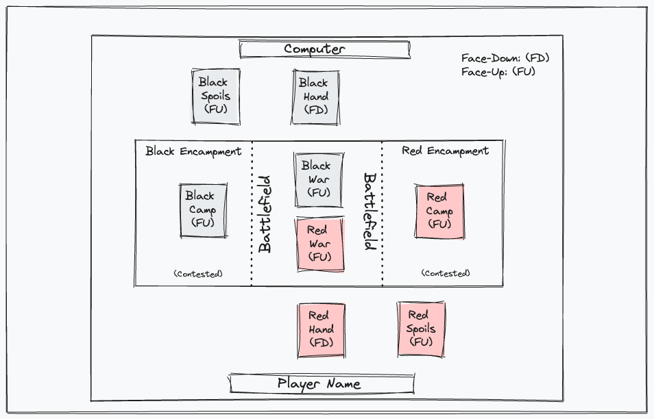

# Group Project One: This Means War
A collaborative card game project between Andrea Cannon, Jonathan Grommesh, Ben Merchant &amp; Tim Scallon.

## Description
In this version of the card game 'War', a human player chooses a color (red or black) and plays against a computer opponent assigned to the opposite color. More information on gameplay and rules can be found in the [Usage](#usage) section below.

## Table of Contents

- [Libraries](#libraries)
- [Usage](#usage)
- [Files](#files)
- [Deployed](#deployed)
- [Credits](#credits)
- [License](#license)

## Libraries

This project uses Bootstrap 5.x.x, jQuery, and cardsJS. 

## Usage

### Game Setup

No special actions are needed from the user; the game kicks off when the user clicks the Start Game button on the index.html landing page.

When the game begins, we get a new Deck ID, and that standard 52-card deck is shuffled.

Each player gets half the deck as their Hand, with the 'red' player taking all red cards (hearts and diamonds), and the 'black' player taking all black cards (clubs and spades). These Hand stacks are shuffled once assigned and placed face-down on the playes' respective sides of the board.

### Game Rules and Play

The game is played in iterative rounds/turns, with both players making their move simultaneously each round/turn.

1. Battle begins: Players simultaneously flip and reveal the top card of their Hand (by clicking the Hand), which appears in the center Battlefield section.

2. The player with the higher card rank wins the Battle, and takes both played cards, placing them face down on their 'Spoils of War' stack.

3. If the cards in the Battle are the same rank, the players enter a War!

#### If War Breaks Out:

1. Both players get the next three cards from their pile face down and place them in their respective Encampments, next to the Battlefield. They each then draw a fourth card and place it face up on their Battlefield stack, to fight once again.

2. The player with the higher face-up card on their side of the Battlefield of course wins the War round and adds all the cards on the table to the bottom of their Hand pile. They take both piles, placing them face down on their 'Spoils of War' stack.

3. If players' new face-up Battlefield cards are the same rank, the War continues (repeat War Step 1)! This mean the longer your current War drags on, the bigger the gains for the winner (and the more catastrophic the losses for their foe)!

6. When a player runs out of cards in their Hand pile, they shuffle their Spoils of War back into it so they can keep playing.

The game continues in this fashion until a player wins via a higher card rank, or until a player runs out of cards COMPLETELY (i.e. no cards in Hand pile, and no remaining cards in the Spoils of War).

    If a player runs out of cards COMPLETELY in the middle of a War, they LOSE THE GAME entirely.

    If a player wins a War without either player running out of cards, the game continues from Battle Begins.

<!-- Alternatively, they can turn their last card face up, and these count as their played card in the war -->

The game as a whole continues until one player wins all the cards from the table. The player who took all the cards is the winner!

## Files

- HTML:
    - index.html: The landing page where a user can get rules and signup for our email list, so we can tell them about updates and new games. This landing is also where the user navigates to the War game itself, choosing a color (red or black) in the process.
    - cardtable.html: The gameplay page where a user plays War, as the color they chose before. If they were in the middle of a game, the game is saved for them to continue.

- CSS:
    - 
- JS:
    - 

## Deployed

[Click here to view the deployed webpage.](https://floatingpoint-exaflop.github.io/group-project-one)

## Credits

### API and Library

[Deck of Cards API](https://www.deckofcardsapi.com/) by [crobertsbmw](https://github.com/crobertsbmw).

[CardsJS](https://richardschneider.github.io/cardsJS/) Copyright © 2015 [Richard Schneider](https://github.com/richardschneider/cardsJS).

Thanks to Eric Meyer for the [reset.css](http://meyerweb.com/eric/tools/css/reset/) code.

Shoutout to [prettycons](https://www.flaticon.com/free-icons/ace-of-spades/) for lending us a favicon png, and to [favicon.io](https://favicon.io/favicon-converter/) for the file build.

### Textures

Cards: [Vector Playing Card Library 1.3](http://code.google.com/p/vectorized-playing-cards/) by [Chris Aguilar](webmaster@totalnonsense.com)

Tabletop Felt: [u/buddingmonkey](https://www.reddit.com/user/buddingmonkey/) via [r/tabletopsimulator](https://www.reddit.com/r/tabletopsimulator/comments/35qk30/i_made_a_felt_tabletop_for_your_custom_large/)

Casino Carpet: [Briton's Design Studio Online](https://www.brintons.net/dso-account/sign-in), via [Pintrest](https://www.pinterest.com/pin/high-energy-colorful-axminster-carpet-designs-for-casino-floor-casinodesign-casinocarpets-casinoc--573223858819239298/)

Wood Border: https://img.freepik.com/premium-photo/old-wooden-texture-background_41471-10627.jpg

## License

MIT License (see repo)